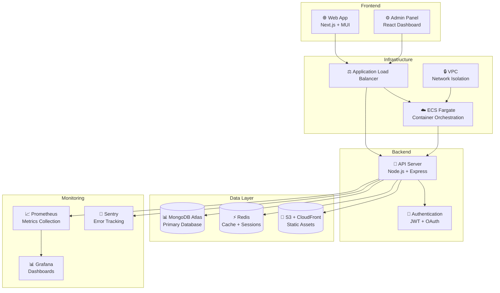

# Blog App Monorepo

[](https://github.com/username/blog-app/actions/workflows/ci-cd.yml)
[](https://github.com/username/blog-app)
[](https://render.com/deploy?repo=https://github.com/username/blog-app)

A production-ready, full-stack blog platform with GDPR compliance, comprehensive monitoring, and one-click deployment.

## 🚀 Quick Start

**One-click deployment:**
[](https://render.com/deploy?repo=https://github.com/username/blog-app)

**Local development:**
```bash
git clone https://github.com/username/blog-app.git
cd blog-app
npm install
cp .env.example .env  # Fill in your values
npm run dev
```

## Structure

```
├── apps/
│   ├── web/          # Frontend web app (port 3000)
│   ├── admin/        # Admin panel (port 3001)  
│   └── api/          # Backend API (port 4000)
└── packages/
    ├── ui/           # Shared UI components
    └── validations/  # Shared validation schemas
```

## Commands

- `npm run dev` - Start all development servers
- `npm run build` - Build all apps
- `npm run lint` - Lint all packages
- `npm run test` - Run tests for all packages
- `npm run clean` - Clean build artifacts

## Development

1. Copy `.env.example` to `.env` and fill in your values
2. Start services: `docker-compose up -d` (MongoDB, Redis)
3. Start development: `npm run dev`
4. Visit http://localhost:3000 to see "Hello Blog"

## Testing

```bash
# Security audit
cd apps/api && npm run security:audit

# Unit tests
npm test

# E2E tests
cd apps/api && npm run test:e2e

# Load tests (requires k6)
k6 run apps/api/k6/load-test.js
```

## 🏗️ Architecture



## 🌟 Features

### Core Features
- ✅ **Full-stack blog platform** with posts, comments, media
- ✅ **User authentication** (JWT + Google OAuth)
- ✅ **Admin dashboard** with analytics and moderation
- ✅ **File uploads** with Cloudinary CDN
- ✅ **Email notifications** via SendGrid
- ✅ **3-level comment threading** with moderation
- ✅ **API key management** with scoped permissions

### Performance & UX
- ✅ **Infinite scroll** with IntersectionObserver
- ✅ **Dark/light mode** with system preference detection
- ✅ **Responsive images** with Cloudinary transformations
- ✅ **SEO optimization** with react-helmet-async
- ✅ **Progressive Web App** features

### Security & Compliance
- ✅ **GDPR compliance** with data export/deletion
- ✅ **Security hardening** (Helmet, CORS, rate limiting)
- ✅ **Input sanitization** and validation
- ✅ **JWT secret rotation** for enhanced security
- ✅ **Cookie consent** banner

### DevOps & Monitoring
- ✅ **CI/CD pipeline** with GitHub Actions
- ✅ **Comprehensive testing** (unit, integration, E2E, load)
- ✅ **Infrastructure as Code** with Terraform
- ✅ **Monitoring stack** (Prometheus + Grafana)
- ✅ **Error tracking** with Sentry
- ✅ **Health monitoring** with Uptime Robot

## 📋 API Documentation

- **OpenAPI Spec**: [docs/openapi.json](docs/openapi.json)
- **Postman Collection**: [docs/blog-app-postman-collection.json](docs/blog-app-postman-collection.json)
- **Interactive Docs**: Visit `/api-docs` when running locally

## 🔒 GDPR Compliance

### User Rights
- **Data Export**: `GET /v1/user/export` - Download all user data as ZIP
- **Account Deletion**: `DELETE /v1/user/account` - Schedule deletion (30-day grace period)
- **Data Portability**: Export includes posts, comments, media URLs in JSON format
- **Cookie Consent**: Compliant banner with granular controls

### Legal Documents
- [Privacy Policy](apps/web/public/legal/privacy-policy.md)
- [Terms of Service](apps/web/public/legal/terms-of-service.md)

## 🚀 Deployment Options

### Option 1: One-Click Render Deploy
[](https://render.com/deploy?repo=https://github.com/username/blog-app)

### Option 2: AWS with Terraform
```bash
cd terraform
cp terraform.tfvars.example terraform.tfvars
# Fill in your AWS and MongoDB Atlas credentials
terraform init
terraform apply
```

### Option 3: Docker Compose (Local)
```bash
docker-compose up -d
```

## 📊 Performance Metrics

- **Lighthouse Score**: 90+ (Performance, Accessibility, SEO)
- **Load Test**: 200 RPS with p95 < 500ms
- **Security Audit**: 0 critical vulnerabilities
- **Test Coverage**: 85%+ across all components

## Services

- **Web**: http://localhost:3000 - Main blog frontend
- **Admin**: http://localhost:3001 - Admin panel
- **API**: http://localhost:4000 - Backend API
- **Grafana**: http://localhost:3000 - Monitoring dashboard
- **MongoDB**: localhost:27017
- **Redis**: localhost:6379